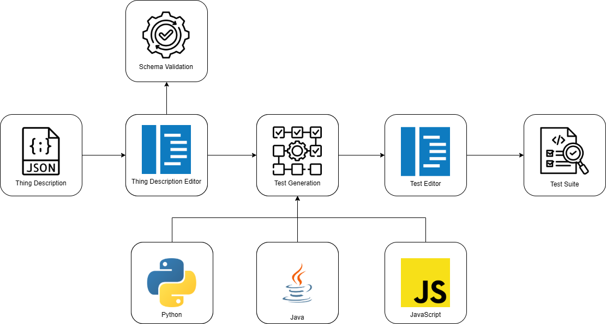

# WIT - WoT Intelligent Testing

WIT is a web application written in TypeScript that enables the automatic generation of test suites from Thing Descriptions compliant with the [W3C Web of Things (WoT)](https://www.w3.org/TR/wot-thing-description-2.0/).

The application provides an integrated editor to upload, write, and validate Thing Descriptions in JSON/JSON-LD format, and generates executable tests in multiple languages (JavaScript, Java, Python) to verify the correct behavior of the described IoT services.

## Main Features

- **Thing Description Editor** — Upload, edit, lint, and format JSON/JSON-LD files
- **Validation** — Check compliance of the Thing Description with the W3C WoT TD standard
- **Automatic Test Generation** — Creation of test suites based on the affordances defined in the TD, with support for:
  - Endpoint verification
  - Data type validation
  - Numeric bounds checking
  - Data length validation
  - Security schemes
- **Multi-language Support** — JavaScript, Java, Python
- **Test Suite Editor** — View, edit, format, and download the generated code

## High level architecture

## Technological Stack

WIT is built using a TypeScript-based full-stack architecture.

### Backend
- **Node.js** — Runtime environment for server-side execution  
- **Fastify** — Web framework for building REST APIs
- **TypeScript** — Strongly typed language

### Frontend
- **Vue.js** — JavaScript framework for building the UI 
- **Vite** — Build tool and development server  
- **TypeScript** — Strongly typed language